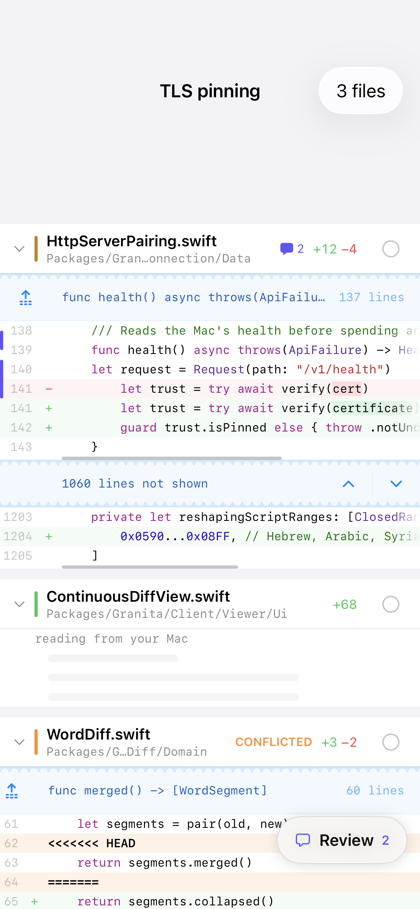
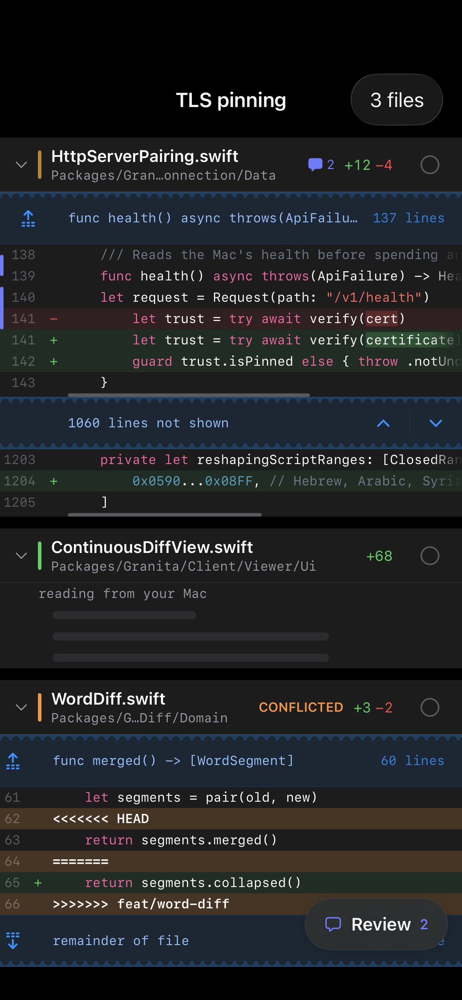
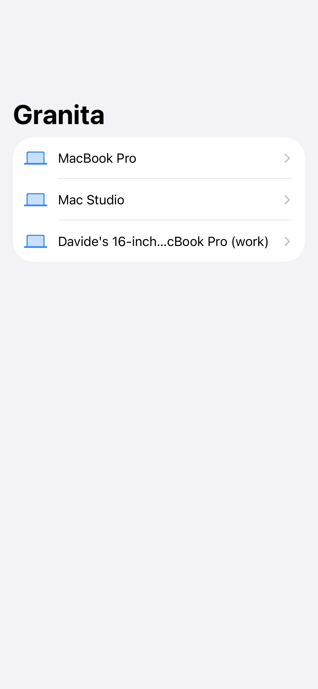
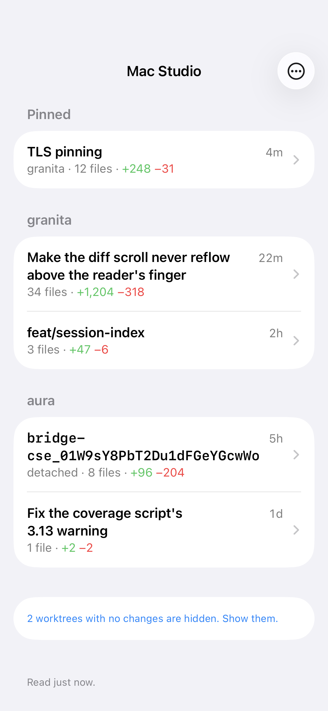
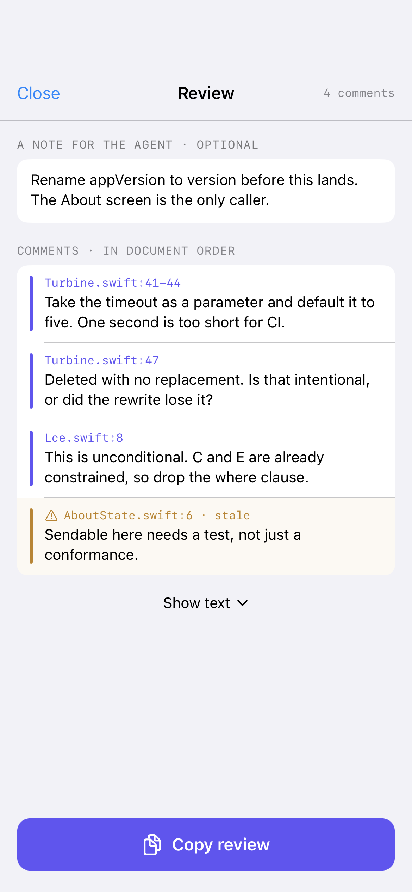
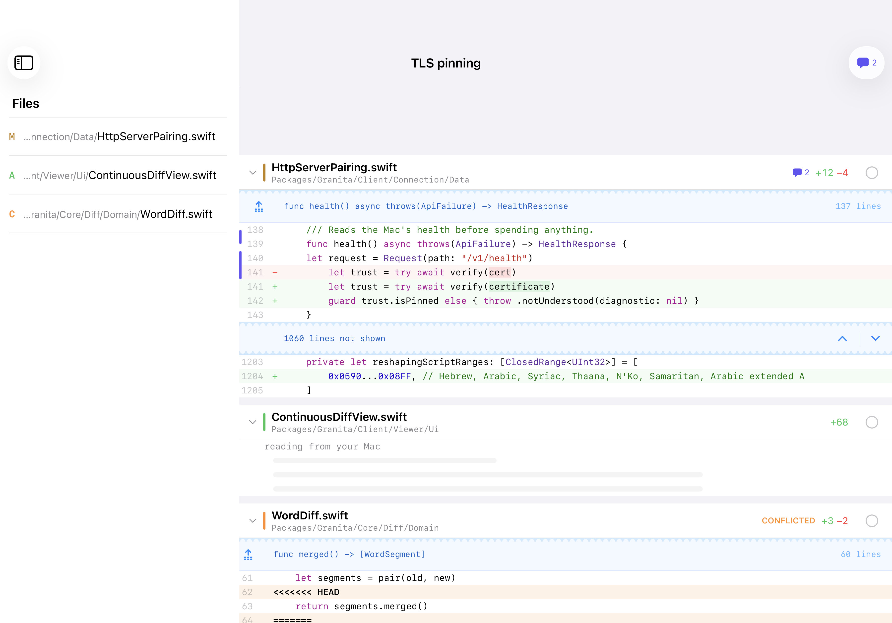
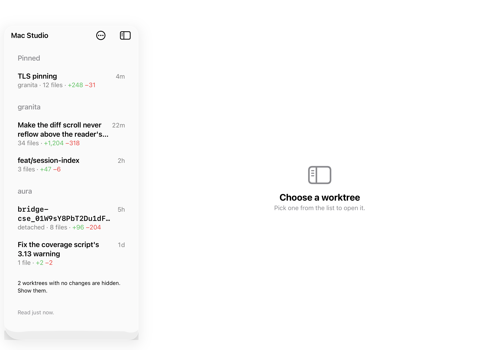
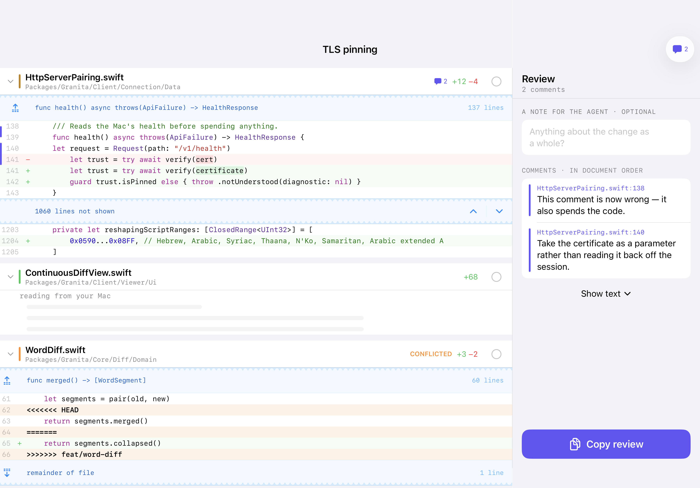
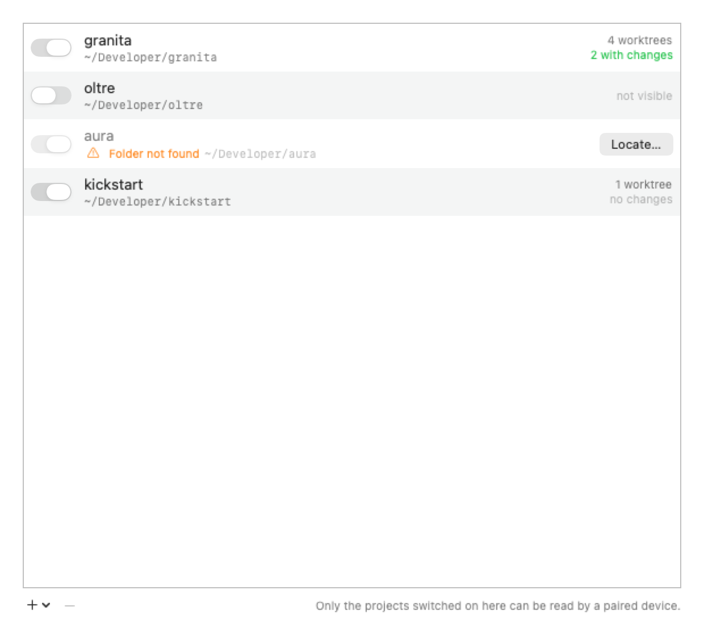

<h1 align="center">Granita</h1>

<p align="center"><strong>Read the code your agent wrote, from your phone.</strong></p>

<p align="center">
  
  
</p>

---

# The product

A Mac menu bar app serves the uncommitted diffs of the worktrees you switch on. An iPhone and iPad
app reads them.

1. On the Mac, add repositories and switch on the ones a phone may read.
2. Pair once — QR code, or six words.
3. Read. Comment as you go, then *Copy review* and paste it to the agent.

### The screens

<table>
  <tr>
    <td width="50%"></td>
    <td width="50%"></td>
  </tr>
  <tr>
    <td align="center"><em>Macs on the network</em></td>
    <td align="center"><em>Worktrees, grouped by project</em></td>
  </tr>
</table>

The diff is every changed file in one scroll: syntax highlighted, word-level changes, conflict
markers, torn bands over what git skipped, mark-as-viewed.

Comment on a line by tapping its number, or on a run by holding one and tapping another. Comments
live on the phone that wrote them; the review copies as text.

<p align="center">
  
</p>

On iPad the file tree is a column beside the code, and the review takes that column when it opens.

<p align="center">
  
  
  
</p>

On the Mac it is a menu bar item and a Settings window — Projects, Devices, Connections, Advanced.

<p align="center">
  
</p>

### Scope and safety

Not a git client: uncommitted work only, no commits, branches or blame. Nothing is served until a
repository is added *and* switched on. TLS with a pinned certificate, a pairing code good for two
minutes and one device, and an API that never accepts a filesystem path — only opaque identifiers
the Mac resolves itself. Logs carry no source and no credentials.

Deleting a worktree is the one thing the phone changes on the Mac. Names and pins live on the phone.

### What's new

- **0.14.1** — the worktree list refreshes when you come back to the app, not just when you come back
  to the screen.
- **0.14.0** — a changed screenshot shows both versions side by side; tap for full screen, hold to
  swap.
- **0.13.0** — a spinner beside the name says when a worktree list or a file list is being re-read.

[Every release](CHANGELOG.md).

---

# The engineering

| | |
|---|---|
| Language | Swift 6, strict concurrency `complete` |
| OS | iOS / iPadOS / macOS 26 |
| UI | SwiftUI. `MenuBarExtra` under `LSUIElement`, `NavigationSplitView` universal. `@Observable` |
| Server | Hummingbird 2 on a `NIOTSEventLoopGroup` — in-process in the menu bar app, and a CLI |
| Git | The `git` binary via swift-subprocess, behind a protocol. Not libgit2 |
| Storage | One JSON document, actor-guarded, atomic replace |
| Tests | Swift Testing, TDD, golden fixtures from real `git`, snapshot baselines |

Three external dependencies — Hummingbird, Highlightr, swift-subprocess — one target each. No DI
framework, no mocking framework. The Mac app is unsandboxed on purpose: a sandboxed process cannot
exec `git` against arbitrary folders.

### Layers

One local package holds everything testable; the two Xcode targets are `@main` shells. A feature is
a directory of one module per layer, and a module's name is its path without slashes —
`Client/Viewer/Data` is `import ClientViewerData`.

| Layer | Depends on | Never |
|---|---|---|
| `Domain` | other `Domain` | frameworks, I/O |
| `Data` | `Domain` + at most one infra dependency | another `Data` |
| `Ui` | `Domain`, SwiftUI | `Presentation`, `Data` |
| `Presentation` | its `Ui`, `Domain` | `Data` |
| `Main` | anything — composition root | being depended on |

`Presentation` depends on `Ui`, not the reverse: `Ui` is stateless views, `Presentation` owns the
view models. Every I/O edge sits behind a `Domain` protocol with a handwritten fake. The rules are
declared in `Package.swift`, so a violation is a compile error.

### Build

```bash
make test        # package suite — no simulator, no Xcode
make build       # compile-check the package and both apps
make coverage    # the coverage gate, locally
make snapshots   # render the screens against committed baselines
make run         # the backend in a terminal
make project     # regenerate Granita.xcodeproj from project.yml
```

`main` is PR-gated: four required checks, squash only, no bypass. Merging archives the phone app to
TestFlight; the Mac app is built by hand (`make run-mac`).

Every screenshot above is a snapshot baseline rendered by
[`ReadmeScreenshotTests`](Apps/GranitaMobileSnapshotTests/ReadmeScreenshotTests.swift) — there is no
folder of exported images to go stale, and a screen that moves turns them red.

### Reading

[`SPEC.md`](SPEC.md) is the specification; its TRAP paragraphs are defects found by running things.
[`.ai/docs/`](.ai/docs) holds the architecture, the design of both halves, and every decision that
departs from the spec. [`.ai/skills/`](.ai/skills) holds the rules an agent working here follows.
